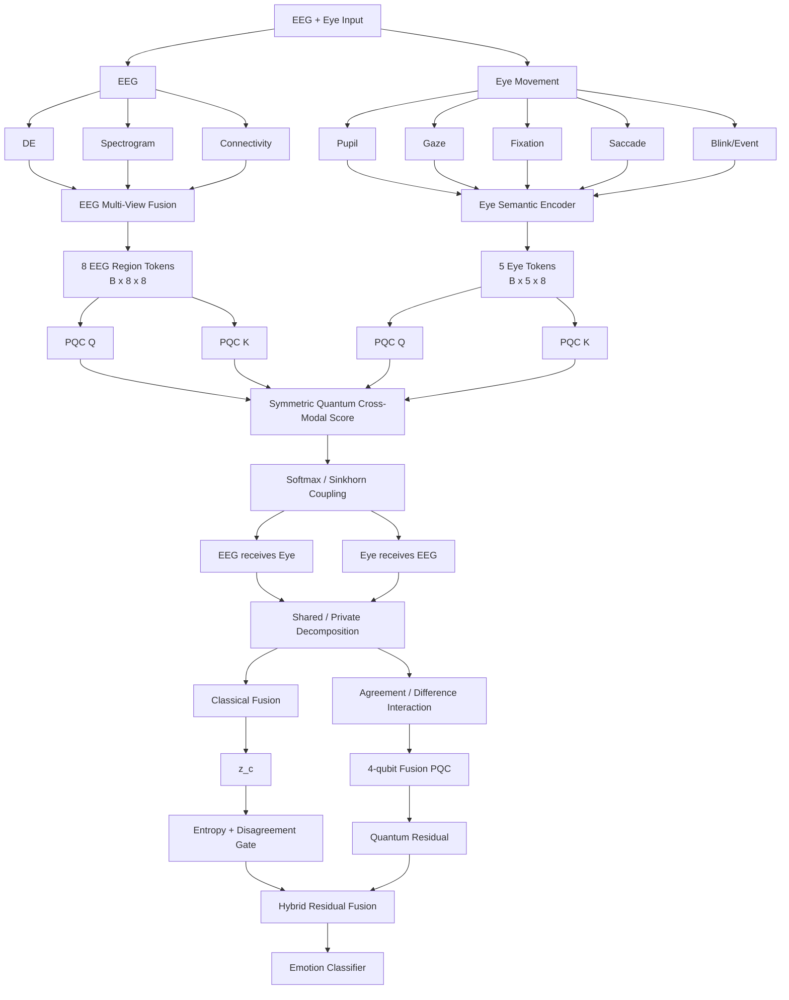

# NeuroQ-Mixer / QK-QCA
## Detailed Implementation Specification for Lightweight Multi-View EEG–Eye Quantum Cross-Attention

**Version:** 0.1 — implementation blueprint  
**Target datasets:** SEED-family multimodal EEG + eye-movement datasets  
**Primary protocol:** strict subject-disjoint / LOSO  
**Primary objective:** maximize EEG–Eye complementarity while keeping the inference network lightweight and making the role of quantum computation explicit and testable.

---

# Table of Contents

1. [Executive Summary](#1-executive-summary)  
2. [Research Positioning](#2-research-positioning)  
3. [Core Design Principles](#3-core-design-principles)  
4. [End-to-End Flow](#4-end-to-end-flow)  
5. [Canonical Input Format](#5-canonical-input-format)  
6. [EEG Multi-View Branch](#6-eeg-multi-view-branch)  
7. [Eye Multi-View Branch](#7-eye-multi-view-branch)  
8. [Shared Temporal Mixer](#8-shared-temporal-mixer)  
9. [Quantum Q/K Projector](#9-quantum-qk-projector)  
10. [Quantum Cross-Attention](#10-quantum-cross-attention)  
11. [Shared–Private Decomposition](#11-sharedprivate-decomposition)  
12. [Classical Fusion Path](#12-classical-fusion-path)  
13. [Final Quantum Interaction Residual](#13-final-quantum-interaction-residual)  
14. [Adaptive Quantum Gate](#14-adaptive-quantum-gate)  
15. [Training Losses](#15-training-losses)  
16. [Training Schedule](#16-training-schedule)  
17. [LOSO Protocol](#17-loso-protocol)  
18. [Repository Structure](#18-repository-structure)  
19. [Module APIs](#19-module-apis)  
20. [Full Forward Pseudocode](#20-full-forward-pseudocode)  
21. [Configuration Files](#21-configuration-files)  
22. [Unit Tests](#22-unit-tests)  
23. [Ablation Plan](#23-ablation-plan)  
24. [Efficiency and Quantum Cost Reporting](#24-efficiency-and-quantum-cost-reporting)  
25. [Visualization and Interpretability](#25-visualization-and-interpretability)  
26. [Debugging Checklist](#26-debugging-checklist)  
27. [Implementation Roadmap](#27-implementation-roadmap)  
28. [Paper Contribution Framing](#28-paper-contribution-framing)  
29. [Recent Research Anchors: 2025–2026](#29-recent-research-anchors-20252026)  
30. [Final Recommended v1 Architecture](#30-final-recommended-v1-architecture)  

---

# 1. Executive Summary

The proposed model is a **lightweight multi-view multimodal EEG–eye network** with two distinct quantum roles.

## Quantum Role 1 — Quantum Query/Key Projection

Conventional attention uses:

\[
Q=XW_Q,\qquad
K=XW_K,\qquad
V=XW_V.
\]

The proposed model replaces the learnable FC projections for **Query** and **Key** with a very small parameterized quantum circuit:

\[
Q=\operatorname{PQC}_Q(X),
\qquad
K=\operatorname{PQC}_K(X).
\]

The default model keeps:

\[
V=X
\]

instead of quantumizing Value.

Therefore the quantum circuit is responsible for learning:

\[
\boxed{\text{brain-region} \leftrightarrow \text{ocular-behavior compatibility}}
\]

rather than being added as a generic block after feature fusion.

---

## Quantum Role 2 — Cross-Modal Residual Correction

After EEG and eye features interact through quantum cross-attention, the model builds compact agreement/disagreement features:

\[
r_{\text{agree}}=c_E\odot c_O,
\]

\[
r_{\text{diff}}=|c_E-c_O|.
\]

They are compressed to 8 dimensions and passed into another 4-qubit circuit:

\[
r_q
\rightarrow
PQC_F
\rightarrow
\Delta z_q.
\]

The final latent representation is:

\[
z_h
=
z_c
+
\alpha\,g_q\,\Delta z_q.
\]

The gate \(g_q\) is driven by:

- classical prediction entropy;
- EEG–Eye disagreement;
- optionally modality reliability.

Thus the two quantum modules solve different problems:

```text
Quantum Q/K
    ↓
learn HOW EEG and Eye should interact

Quantum Fusion PQC
    ↓
refine difficult cross-modal decisions
```

---

# 2. Research Positioning

This model should not be presented as:

> “EEG + Eye + Attention + Quantum + KAN.”

That would sound like module stacking.

The paper story should instead be:

> **A lightweight multi-view neuro-ocular architecture where compact quantum circuits replace conventional query/key projections to learn brain–eye relational compatibility, while a second gated quantum residual models high-order cross-modal disagreement only after classical information fusion.**

---

## 2.1 Relation to QNeuro

Useful ideas to inherit:

- aggressive latent compression;
- 4-qubit VQC;
- shallow depth;
- angle encoding;
- parameter-efficient decoder;
- data re-uploading.

Do **not** copy QNeuro as a full backbone.

New role:

```text
QNeuro:
latent → quantum → classifier

NeuroQ-Mixer:
token → quantum Q/K → attention relation
+
cross-modal interaction → quantum residual
```

---

## 2.2 Relation to QuanKAN

Useful ideas:

- uncertainty-based quantum residual;
- subject-invariant learning;
- lightweight temporal modeling.

Improvement:

QuanKAN-style entropy gate:

\[
g=g(H(p)).
\]

Proposed gate:

\[
g_q
=
g(
H(p_c),
D(c_E,c_O),
R_E,R_O
).
\]

Thus uncertainty becomes multimodal.

---

## 2.3 Relation to E2G

Useful ideas:

- multi-domain EEG representation;
- temporal, frequency, time-frequency and connectivity information;
- small quantum measurement vector.

Difference:

E2G primarily exploits multiple physical domains **inside EEG**.

The proposed model uses EEG multi-view representation as one side of:

\[
\boxed{\text{EEG multi-view} \leftrightarrow \text{Eye multi-view}}
\]

and puts quantum computation directly in cross-modal interaction.

---

# 3. Core Design Principles

## Principle A — Distinguish modality from view

Two modalities:

```text
1. EEG
2. Eye movement
```

Within EEG:

```text
DE
Spectrogram
Functional connectivity
Optional raw temporal view
```

Within Eye:

```text
Pupil
Gaze
Fixation
Saccade
Blink/Event
Optional pupil-frequency view
```

Do not call DE or spectrogram separate modalities.

---

## Principle B — Keep token dimension equal to 8

Canonical cross-modal token size:

\[
d=8.
\]

Reason:

A 4-qubit circuit can map 8 input numbers naturally using:

```text
4 × RY angles
4 × RZ angles
```

and return 8 measurements naturally using:

```text
4 × <Z_i>
4 × <Z_i Z_{i+1}>
```

Thus:

\[
\boxed{\mathbb{R}^8 \rightarrow PQC_{4q} \rightarrow \mathbb{R}^8}
\]

without pre/post FC inside the quantum projector.

---

## Principle C — Quantumize Q/K first, not everything

Default:

\[
Q=PQC_Q(X),
\]

\[
K=PQC_K(X),
\]

\[
V=X.
\]

Reason:

- Q/K determine relation;
- V transports information;
- fewer circuit evaluations;
- preserves source modality features;
- easier training.

Full QKV-quantum attention should be an ablation, not the default.

---

## Principle D — Shared circuit topology across modalities

Use the same:

```text
PQC_Q
PQC_K
```

for EEG and Eye.

But use modality-specific angle adapters:

```text
EEG token
→ EEG angle adapter
→ shared PQC_Q / PQC_K

Eye token
→ Eye angle adapter
→ shared PQC_Q / PQC_K
```

This gives a common quantum relation space with modality-specific encoding.

---

## Principle E — Training can be heavier than inference

Allowed as training-only components:

- subject classifier;
- GRL;
- auxiliary view classifiers;
- classical attention teacher;
- prototype memory;
- masked-modality branch.

Remove these during deployment.

---

# 4. End-to-End Flow

## 4.1 High-level flow

```text
                           INPUT
              EEG signal + Eye movement
                         │
            ┌────────────┴────────────┐
            │                         │
            ▼                         ▼
       EEG modality               Eye modality
            │                         │
   ┌────────┼─────────┐       ┌───────┼──────────┐
   │        │         │       │       │          │
   ▼        ▼         ▼       ▼       ▼          ▼
  DE      STFT   Connectivity Pupil   Gaze   Event features
   │        │         │       │       │     Fix/Sacc/Blink
   └────────┼─────────┘       └───────┼──────────┘
            │                         │
            ▼                         ▼
  EEG Multi-View Encoder      Eye Multi-View Encoder
            │                         │
            ▼                         ▼
       [B,8,8]                   [B,5,8]
    8 brain tokens            5 eye tokens
            │                         │
        ┌───┴───┐                 ┌───┴───┐
        ▼       ▼                 ▼       ▼
      PQC_Q   PQC_K             PQC_Q   PQC_K
        │       │                 │       │
        ▼       ▼                 ▼       ▼
       Q_E     K_E               Q_O     K_O
         \       \               /       /
          \       \             /       /
           └──── Quantum compatibility ┘
                         │
                         ▼
               Symmetric coupling score
                         │
               Softmax / Sinkhorn
                         │
                         ▼
              Brain–Eye coupling P
                         │
             ┌───────────┴───────────┐
             ▼                       ▼
       EEG receives Eye        Eye receives EEG
             │                       │
             └───────────┬───────────┘
                         ▼
              Shared/Private Split
                         │
       ┌─────────────────┴─────────────────┐
       ▼                                   ▼
 Classical multimodal fusion      Interaction features
       │                            agree / difference
       ▼                                   │
     z_c                                  8-D
       │                                   │
       │                             4q Fusion PQC
       │                                   │
       │                                 Δz_q
       │                                   │
       └──── entropy + disagreement ────────┘
                         │
                         ▼
                  Quantum gate g_q
                         │
                         ▼
              z_h = z_c + α g_q Δz_q
                         │
                         ▼
                     Classifier
                         │
                         ▼
                       Emotion
```

---

## 4.2 Mermaid flow



---

# 5. Canonical Input Format

The most important engineering rule is to normalize every dataset adapter into the same dictionary.

```python
batch = {
    "eeg_de":      Tensor[B, T, 62, 5],
    "eeg_spec":    Tensor[B, T, 8, F, Ts],
    "eeg_conn":    Tensor[B, T, 5, 8, 8],

    "eye": {
        "pupil":    Tensor[B, T, Dp],
        "gaze":     Tensor[B, T, Dg],
        "fixation": Tensor[B, T, Df],
        "saccade":  Tensor[B, T, Ds],
        "blink":    Tensor[B, T, Db],
    },

    "label":   LongTensor[B],
    "subject": LongTensor[B],
    "session": LongTensor[B],
}
```

---

## 5.1 EEG DE

Expected:

```text
[B,T,62,5]
```

5 canonical bands:

```text
delta
theta
alpha
beta
gamma
```

If dataset-provided DE already exists, use it.

If only raw EEG exists, compute DE offline.

---

## 5.2 EEG spectrogram

Recommended cached format:

```text
[B,T,8,F,Ts]
```

Do not keep 62 full spectrogram images inside training if the target is lightweight.

Preferred preprocessing:

```text
62 electrodes
→ anatomical region average
→ 8 regional time series
→ STFT
```

---

## 5.3 Functional connectivity

Canonical:

```text
[B,T,5,8,8]
```

Possible connectivity measures:

```text
Pearson
PLV
coherence
PCMI
```

Recommended implementation order:

```text
1. Pearson baseline
2. PLV
3. coherence
4. PCMI only if needed
```

The architecture should not depend on one specific connectivity estimator.

---

## 5.4 Eye groups

Use semantic groups instead of one anonymous 31D/33D vector.

Possible grouping:

```text
Pupil:
- mean pupil diameter
- variance/std
- pupil differential entropy
- pupil frequency features

Gaze:
- gaze X/Y
- gaze dispersion
- trajectory statistics

Fixation:
- fixation count
- mean duration
- max duration
- dispersion

Saccade:
- count
- duration
- amplitude
- velocity

Blink/Event:
- blink count
- blink duration
- event frequencies
```

The exact dimensions depend on dataset metadata.

Do **not** invent missing groups.

If a dataset does not contain a group, use a mask mechanism.

---

# 6. EEG Multi-View Branch

---

## 6.1 Electrode → Brain Region Pooling

Target:

```text
62 electrodes
→ 8 regions
```

Example conceptual groups:

```text
R0 Frontal
R1 Fronto-Central
R2 Central
R3 Left Temporal
R4 Right Temporal
R5 Parietal
R6 Parieto-Occipital
R7 Occipital
```

The exact electrode mapping must match dataset channel ordering.

### API

```python
class FixedRegionPool(nn.Module):
    def __init__(self, region_indices):
        super().__init__()
        self.region_indices = region_indices

    def forward(self, x):
        # x: [B,T,62,D]
        regions = []
        for idx in self.region_indices:
            regions.append(
                x[:, :, idx, :].mean(dim=2)
            )

        return torch.stack(regions, dim=2)
        # [B,T,8,D]
```

Default is parameter-free.

---

## 6.2 DE View Encoder

Input:

```text
[B,T,62,5]
```

Region pool:

```text
[B,T,8,5]
```

Projection:

\[
5\rightarrow8.
\]

```python
class DEViewEncoder(nn.Module):
    def __init__(self, d_model=8):
        super().__init__()
        self.norm = nn.LayerNorm(5)
        self.proj = nn.Linear(
            5, d_model, bias=False
        )

    def forward(self, x):
        x = self.norm(x)
        return torch.tanh(self.proj(x))
```

Output:

```text
H_DE [B,T,8,8]
```

---

## 6.3 Spectrogram View Encoder

### Offline STFT

For regional EEG:

\[
S_r(f,\tau)
=
\log(1+|\operatorname{STFT}(x_r)|^2).
\]

Example starting configuration:

```yaml
stft:
  n_fft: 64
  win_length: 64
  hop_length: 16
  log_power: true
```

Tune using actual sampling rate.

### Tiny encoder

```text
Spectrogram
→ depthwise / tiny Conv2D
→ pointwise 1×1
→ GELU
→ global average pooling
→ 8-D
```

Implementation:

```python
class TinySpectrogramEncoder(nn.Module):
    def __init__(self, d_model=8):
        super().__init__()

        self.conv = nn.Sequential(
            nn.Conv2d(
                1, 4,
                kernel_size=3,
                padding=1,
                bias=False
            ),
            nn.GELU(),

            nn.Conv2d(
                4, 8,
                kernel_size=1,
                bias=False
            ),
            nn.GELU(),

            nn.AdaptiveAvgPool2d(1)
        )

        self.out = nn.Linear(
            8, d_model, bias=False
        )

    def forward(self, x):
        # x: [B,T,R,F,Ts]

        B,T,R,Fq,Tq = x.shape

        x = x.reshape(
            B*T*R, 1, Fq, Tq
        )

        h = self.conv(x).flatten(1)
        h = self.out(h)

        return h.reshape(
            B,T,R,-1
        )
```

Output:

```text
H_SPEC [B,T,8,8]
```

---

## 6.4 Connectivity View Encoder

Input:

```text
C [B,T,5,8,8]
```

Use one learnable embedding per frequency band:

```python
self.band_embed = nn.Parameter(
    torch.randn(5, 8) * 0.02
)
```

Message aggregation:

\[
h_{i}
=
\sum_f\sum_j
C_{fij}e_f.
\]

Implementation:

```python
class ConnectivityViewEncoder(nn.Module):
    def __init__(
        self,
        n_bands=5,
        d_model=8
    ):
        super().__init__()

        self.band_embed = nn.Parameter(
            torch.randn(
                n_bands,
                d_model
            ) * 0.02
        )

        self.norm = nn.LayerNorm(d_model)

    def forward(self, conn):
        # conn [B,T,F,R,R]

        h = torch.einsum(
            "btfij,fd->btid",
            conn,
            self.band_embed
        )

        return self.norm(h)
```

Output:

```text
H_CONN [B,T,8,8]
```

No deep GNN in v1.

---

## 6.5 Optional Raw Temporal EEG View

Do not enable in the first implementation.

Optional:

```text
raw region signal
→ depthwise Conv1D k=3
→ depthwise Conv1D k=5
→ adaptive pool
→ 8-D
```

Config:

```yaml
use_raw_temporal_view: false
```

---

## 6.6 EEG View Reliability Fusion

Inputs:

```text
DE
SPEC
CONN
```

Stack:

```text
[B,T,8,V,8]
```

with:

```text
V=3
```

Score:

\[
s_{v}
=
w^T h_v+b_v
\]

\[
\alpha_v
=
softmax_v(s_v)
\]

\[
H_E
=
\sum_v
\alpha_vh_v.
\]

Implementation:

```python
class ViewReliabilityFusion(nn.Module):
    def __init__(
        self,
        d_model=8,
        n_views=3
    ):
        super().__init__()

        self.score_vec = nn.Parameter(
            torch.randn(d_model) * 0.02
        )

        self.view_bias = nn.Parameter(
            torch.zeros(n_views)
        )

    def forward(self, views):
        # views [B,T,R,V,D]

        score = torch.einsum(
            "btrvd,d->btrv",
            views,
            self.score_vec
        )

        score = score + self.view_bias

        alpha = torch.softmax(
            score,
            dim=-1
        )

        fused = (
            views *
            alpha.unsqueeze(-1)
        ).sum(dim=3)

        return fused, alpha
```

Output:

```text
H_E_temporal [B,T,8,8]
alpha_eeg [B,T,8,3]
```

---

# 7. Eye Multi-View Branch

Eye movement is converted to 5 semantic tokens.

```text
0 Pupil
1 Gaze
2 Fixation
3 Saccade
4 Blink/Event
```

---

## 7.1 Group projector

```python
class EyeGroupProjector(nn.Module):
    def __init__(
        self,
        in_dim,
        d_model=8
    ):
        super().__init__()

        self.norm = nn.LayerNorm(in_dim)

        self.proj = nn.Linear(
            in_dim,
            d_model,
            bias=False
        )

    def forward(self, x):
        return torch.tanh(
            self.proj(
                self.norm(x)
            )
        )
```

---

## 7.2 Eye encoder

```python
class EyeMultiViewEncoder(nn.Module):
    def __init__(
        self,
        eye_dims,
        d_model=8
    ):
        super().__init__()

        self.names = [
            "pupil",
            "gaze",
            "fixation",
            "saccade",
            "blink",
        ]

        self.projectors = nn.ModuleDict({
            name: EyeGroupProjector(
                eye_dims[name],
                d_model
            )
            for name in self.names
        })

    def forward(self, eye):
        tokens = []

        for name in self.names:
            h = self.projectors[name](
                eye[name]
            )

            tokens.append(h)

        return torch.stack(
            tokens,
            dim=2
        )
```

Output:

```text
[B,T,5,8]
```

---

## 7.3 Missing eye group handling

If a group does not exist in one dataset:

Option A:

```text
learned missing token
```

Option B:

```text
zero token + availability mask
```

Recommended:

```text
zero token + binary group mask
```

because it is explicit.

Do not silently fill unavailable features with random numbers.

---

# 8. Shared Temporal Mixer

Both EEG and Eye tokens are already 8-D.

Use one shared temporal operator.

Input EEG:

```text
[B,T,8,8]
```

reshape to:

```text
[B,8,T,8]
```

Input Eye:

```text
[B,T,5,8]
```

reshape to:

```text
[B,5,T,8]
```

---

## 8.1 Tiny temporal block

```text
Depthwise Conv1D k=3
→ Pointwise Conv1D
→ GELU
→ residual
→ temporal attention pooling
```

```python
class TinyTemporalMixer(nn.Module):
    def __init__(
        self,
        d_model=8
    ):
        super().__init__()

        self.dw = nn.Conv1d(
            d_model,
            d_model,
            kernel_size=3,
            padding=1,
            groups=d_model,
            bias=False
        )

        self.pw = nn.Conv1d(
            d_model,
            d_model,
            kernel_size=1,
            bias=False
        )

        self.norm = nn.LayerNorm(
            d_model
        )

        self.pool_score = nn.Linear(
            d_model,
            1
        )

    def forward(self, x):
        # x [B,N,T,D]

        B,N,T,D = x.shape

        y = x.permute(
            0,1,3,2
        ).reshape(
            B*N,D,T
        )

        residual = y

        y = self.dw(y)
        y = F.gelu(y)
        y = self.pw(y)

        y = y + residual

        y = y.reshape(
            B,N,D,T
        ).permute(
            0,1,3,2
        )

        y = self.norm(y)

        score = self.pool_score(
            y
        ).squeeze(-1)

        alpha = torch.softmax(
            score,
            dim=-1
        )

        pooled = (
            y *
            alpha.unsqueeze(-1)
        ).sum(dim=2)

        return pooled, alpha
```

Output:

```text
EEG: [B,8,8]
Eye: [B,5,8]
```

---

# 9. Quantum Q/K Projector

This is the main architectural contribution.

---

## 9.1 Input normalization

Before angle encoding:

\[
x\in\mathbb{R}^8.
\]

Apply modality-specific affine map:

\[
a_m
=
\pi\tanh(
\gamma_m\odot x+\beta_m
).
\]

```python
class ModalityAngleAdapter(nn.Module):
    def __init__(self, d_model=8):
        super().__init__()

        self.gamma = nn.Parameter(
            torch.ones(d_model)
        )

        self.beta = nn.Parameter(
            torch.zeros(d_model)
        )

    def forward(self, x):
        return torch.pi * torch.tanh(
            x * self.gamma +
            self.beta
        )
```

Use:

```text
angle_adapter_eeg
angle_adapter_eye
```

---

## 9.2 Angle encoding

For one token:

\[
a=
[a_1,\ldots,a_8].
\]

Encoding:

```text
q0: RY(a1), RZ(a5)
q1: RY(a2), RZ(a6)
q2: RY(a3), RZ(a7)
q3: RY(a4), RZ(a8)
```

---

## 9.3 Variational circuit

Default:

```yaml
n_qubits: 4
depth: 2
```

Each depth:

```text
data encoding
→ trainable RY/RZ
→ ring CNOT
```

Circuit sketch:

```text
q0 ─RY(a1)─RZ(a5)─RY(θ00)─RZ(φ00)─■────────────X─
                                    │            │
q1 ─RY(a2)─RZ(a6)─RY(θ01)─RZ(φ01)─X─■──────────│─
                                      │          │
q2 ─RY(a3)─RZ(a7)─RY(θ02)─RZ(φ02)────X─■────────│─
                                        │        │
q3 ─RY(a4)─RZ(a8)─RY(θ03)─RZ(φ03)──────X────────■─

repeat for depth=2
```

The data may be re-uploaded in each layer.

---

## 9.4 Readout

Output exactly 8 values:

\[
[
\langle Z_0\rangle,
\langle Z_1\rangle,
\langle Z_2\rangle,
\langle Z_3\rangle,
\]

\[
\langle Z_0Z_1\rangle,
\langle Z_1Z_2\rangle,
\langle Z_2Z_3\rangle,
\langle Z_3Z_0\rangle
].
\]

Thus:

\[
PQC:\mathbb R^8\rightarrow\mathbb R^8.
\]

No learned FC is needed after the circuit.

---

## 9.5 PennyLane skeleton

```python
import pennylane as qml
import torch
import torch.nn as nn


class FourQubitProjector(nn.Module):
    def __init__(
        self,
        depth=2,
        device_name="default.qubit",
        diff_method="backprop",
    ):
        super().__init__()

        self.depth = depth
        self.n_qubits = 4

        self.theta = nn.Parameter(
            0.05 * torch.randn(
                depth,
                4,
                2
            )
        )

        self.dev = qml.device(
            device_name,
            wires=self.n_qubits
        )

        @qml.qnode(
            self.dev,
            interface="torch",
            diff_method=diff_method
        )
        def circuit(angles, theta):

            for layer in range(
                self.depth
            ):

                # data re-upload
                for q in range(4):
                    qml.RY(
                        angles[q],
                        wires=q
                    )
                    qml.RZ(
                        angles[q + 4],
                        wires=q
                    )

                # trainable rotation
                for q in range(4):
                    qml.RY(
                        theta[layer,q,0],
                        wires=q
                    )
                    qml.RZ(
                        theta[layer,q,1],
                        wires=q
                    )

                # ring entanglement
                for q in range(4):
                    qml.CNOT(
                        wires=[
                            q,
                            (q + 1) % 4
                        ]
                    )

            return (
                qml.expval(
                    qml.PauliZ(0)
                ),
                qml.expval(
                    qml.PauliZ(1)
                ),
                qml.expval(
                    qml.PauliZ(2)
                ),
                qml.expval(
                    qml.PauliZ(3)
                ),

                qml.expval(
                    qml.PauliZ(0)
                    @ qml.PauliZ(1)
                ),
                qml.expval(
                    qml.PauliZ(1)
                    @ qml.PauliZ(2)
                ),
                qml.expval(
                    qml.PauliZ(2)
                    @ qml.PauliZ(3)
                ),
                qml.expval(
                    qml.PauliZ(3)
                    @ qml.PauliZ(0)
                ),
            )

        self.circuit = circuit

    def forward_single(self, x):
        out = self.circuit(
            x,
            self.theta
        )

        return torch.stack(
            list(out),
            dim=-1
        )

    def forward(self, x):
        # x [...,8]

        shape = x.shape[:-1]

        flat = x.reshape(
            -1,8
        )

        outputs = [
            self.forward_single(v)
            for v in flat
        ]

        out = torch.stack(
            outputs,
            dim=0
        )

        return out.reshape(
            *shape,8
        )
```

### Important

The loop-based version is for correctness first.

After successful training:

- benchmark `qml.batch_input`;
- benchmark vectorized QNodes;
- test `lightning.qubit`;
- separate simulator latency from parameter count.

---

## 9.6 Quantum parameters

For:

```text
4 qubits
depth = 2
RY + RZ
```

trainable variational parameters:

\[
4\times2\times2=16.
\]

Q projector:

```text
16
```

K projector:

```text
16
```

Final fusion projector:

```text
16
```

Core circuit parameters:

```text
48
```

This excludes classical angle adapters.

---

# 10. Quantum Cross-Attention

---

## 10.1 Shared projectors

Use:

```python
self.q_proj = FourQubitProjector(...)
self.k_proj = FourQubitProjector(...)
```

for both modalities.

Compute:

```python
E_angles = self.eeg_angle(H_E)
O_angles = self.eye_angle(H_O)

Q_E = self.q_proj(E_angles)
K_E = self.k_proj(E_angles)

Q_O = self.q_proj(O_angles)
K_O = self.k_proj(O_angles)
```

Shapes:

```text
Q_E [B,8,8]
K_E [B,8,8]

Q_O [B,5,8]
K_O [B,5,8]
```

---

## 10.2 Directional scores

EEG queries Eye:

\[
S_{EO}
=
\frac{
Q_EK_O^T
}{
\sqrt8
}.
\]

Shape:

```text
[B,8,5]
```

Eye queries EEG:

\[
S_{OE}
=
\frac{
Q_OK_E^T
}{
\sqrt8
}.
\]

Shape:

```text
[B,5,8]
```

---

## 10.3 Symmetric score

Create one shared brain-eye compatibility map:

\[
S
=
\frac12
(
S_{EO}
+
S_{OE}^T
).
\]

Shape:

```text
[B,8,5]
```

This avoids having two unrelated cross-attention blocks.

---

## 10.4 Learnable temperature

\[
S\leftarrow
\frac{S}{\tau}.
\]

Use positive parameterization:

```python
tau = F.softplus(
    raw_temperature
) + 1e-4
```

---

## 10.5 Baseline normalization — Softmax

EEG → Eye:

```python
P_eo = torch.softmax(
    S,
    dim=-1
)
```

Eye → EEG:

```python
P_oe = torch.softmax(
    S.transpose(-1,-2),
    dim=-1
)
```

---

## 10.6 Proposed normalization — Sinkhorn

Implement only after Softmax works.

Suggested stable log version:

```python
def sinkhorn_rectangular(
    score,
    n_iters=5,
):
    log_p = score

    for _ in range(n_iters):

        # normalize rows
        log_p = (
            log_p -
            torch.logsumexp(
                log_p,
                dim=-1,
                keepdim=True
            )
        )

        # normalize cols
        log_p = (
            log_p -
            torch.logsumexp(
                log_p,
                dim=-2,
                keepdim=True
            )
        )

    return torch.exp(log_p)
```

Then separately normalize message weights:

```python
P_eo = P / P.sum(
    -1,
    keepdim=True
).clamp_min(1e-8)

P_oe = P.transpose(-1,-2)
P_oe = P_oe / P_oe.sum(
    -1,
    keepdim=True
).clamp_min(1e-8)
```

Because the matrix is rectangular:

```text
8 × 5
```

do not describe it as a strict square doubly-stochastic matrix.

Use wording:

> balanced rectangular coupling.

---

## 10.7 Value path

Default:

\[
V_E=H_E,
\]

\[
V_O=H_O.
\]

No FC.

No quantum Value projector.

---

## 10.8 Cross-modal updates

EEG receives Eye:

\[
H'_E
=
H_E
+
\alpha_E
P_{EO}H_O.
\]

Eye receives EEG:

\[
H'_O
=
H_O
+
\alpha_O
P_{OE}H_E.
\]

Initialize:

```python
alpha_e = nn.Parameter(
    torch.tensor(0.1)
)

alpha_o = nn.Parameter(
    torch.tensor(0.1)
)
```

This keeps the initial model close to identity.

---

## 10.9 Full module skeleton

```python
class QuantumCrossAttention(nn.Module):
    def __init__(
        self,
        d_model=8,
        q_depth=2,
        use_sinkhorn=False,
        sinkhorn_iters=5,
    ):
        super().__init__()

        assert d_model == 8

        self.eeg_angle = (
            ModalityAngleAdapter(
                d_model
            )
        )

        self.eye_angle = (
            ModalityAngleAdapter(
                d_model
            )
        )

        self.q_proj = (
            FourQubitProjector(
                depth=q_depth
            )
        )

        self.k_proj = (
            FourQubitProjector(
                depth=q_depth
            )
        )

        self.norm_e = nn.LayerNorm(
            d_model
        )

        self.norm_o = nn.LayerNorm(
            d_model
        )

        self.alpha_e = nn.Parameter(
            torch.tensor(0.1)
        )

        self.alpha_o = nn.Parameter(
            torch.tensor(0.1)
        )

        self.raw_temperature = (
            nn.Parameter(
                torch.tensor(0.0)
            )
        )

        self.use_sinkhorn = (
            use_sinkhorn
        )

        self.sinkhorn_iters = (
            sinkhorn_iters
        )

    def forward(
        self,
        H_E,
        H_O
    ):
        E = self.norm_e(H_E)
        O = self.norm_o(H_O)

        ang_E = self.eeg_angle(E)
        ang_O = self.eye_angle(O)

        Q_E = self.q_proj(ang_E)
        K_E = self.k_proj(ang_E)

        Q_O = self.q_proj(ang_O)
        K_O = self.k_proj(ang_O)

        S_eo = (
            Q_E @
            K_O.transpose(-1,-2)
        ) / math.sqrt(8.0)

        S_oe = (
            Q_O @
            K_E.transpose(-1,-2)
        ) / math.sqrt(8.0)

        S = 0.5 * (
            S_eo +
            S_oe.transpose(-1,-2)
        )

        tau = (
            F.softplus(
                self.raw_temperature
            ) + 1e-4
        )

        S = S / tau

        if self.use_sinkhorn:

            P = sinkhorn_rectangular(
                S,
                self.sinkhorn_iters
            )

            P_eo = (
                P /
                P.sum(
                    -1,
                    keepdim=True
                ).clamp_min(1e-8)
            )

            P_oe = P.transpose(-1,-2)

            P_oe = (
                P_oe /
                P_oe.sum(
                    -1,
                    keepdim=True
                ).clamp_min(1e-8)
            )

        else:

            P_eo = torch.softmax(
                S,
                dim=-1
            )

            P_oe = torch.softmax(
                S.transpose(-1,-2),
                dim=-1
            )

        E_out = (
            H_E +
            self.alpha_e *
            (P_eo @ H_O)
        )

        O_out = (
            H_O +
            self.alpha_o *
            (P_oe @ H_E)
        )

        return E_out, O_out, {
            "Q_E": Q_E,
            "K_E": K_E,
            "Q_O": Q_O,
            "K_O": K_O,
            "S": S,
            "P_eo": P_eo,
            "P_oe": P_oe,
            "temperature": tau,
        }
```

---

# 11. Shared–Private Decomposition

The model must not force EEG and Eye to become identical.

After cross-attention:

```text
E_cross [B,8,8]
O_cross [B,5,8]
```

Pool:

```python
e = E_cross.mean(dim=1)
o = O_cross.mean(dim=1)
```

Initial v1 uses mean pooling.

Later ablate attention pooling.

---

## 11.1 Four representations

\[
c_E = f_E^{common}(e)
\]

\[
p_E = f_E^{private}(e)
\]

\[
c_O = f_O^{common}(o)
\]

\[
p_O = f_O^{private}(o)
\]

Recommended dimension:

```text
8 each
```

---

## 11.2 Implementation

```python
class SharedPrivateDecomposition(
    nn.Module
):
    def __init__(
        self,
        d_model=8
    ):
        super().__init__()

        self.c_e = nn.Linear(
            d_model,
            d_model,
            bias=False
        )

        self.p_e = nn.Linear(
            d_model,
            d_model,
            bias=False
        )

        self.c_o = nn.Linear(
            d_model,
            d_model,
            bias=False
        )

        self.p_o = nn.Linear(
            d_model,
            d_model,
            bias=False
        )

    def forward(
        self,
        e,
        o
    ):
        c_e = torch.tanh(
            self.c_e(e)
        )

        p_e = torch.tanh(
            self.p_e(e)
        )

        c_o = torch.tanh(
            self.c_o(o)
        )

        p_o = torch.tanh(
            self.p_o(o)
        )

        return (
            c_e,
            p_e,
            c_o,
            p_o,
        )
```

---

## 11.3 Possible stronger variant

Share the common projector:

\[
f_E^{common}
=
f_O^{common}
\]

while keeping private projectors separate.

This is a good ablation:

```text
separate common projectors
vs
shared common projector
```

---

# 12. Classical Fusion Path

Input:

```text
c_E 8
c_O 8
p_E 8
p_O 8
```

Concatenate:

```text
32-D
```

Fusion:

```text
LayerNorm 32
→ Linear 32→16
→ GELU
```

```python
self.classical_fusion = nn.Sequential(
    nn.LayerNorm(32),
    nn.Linear(
        32,
        16,
        bias=False
    ),
    nn.GELU(),
)
```

Output:

```text
z_c [B,16]
```

---

## 12.1 Classical auxiliary head

Needed for entropy:

```python
self.classical_head = nn.Linear(
    16,
    num_classes
)
```

Produces:

```text
classical_logits
```

This is the prediction before final quantum residual.

---

# 13. Final Quantum Interaction Residual

---

## 13.1 Agreement feature

\[
r_a
=
c_E\odot c_O
\]

shape:

```text
[B,8]
```

---

## 13.2 Disagreement feature

\[
r_d
=
|c_E-c_O|
\]

shape:

```text
[B,8]
```

---

## 13.3 Concatenate and compress

\[
r=
[r_a;r_d]
\in\mathbb R^{16}
\]

Then:

\[
r_q=W_r r
\in\mathbb R^8.
\]

```python
self.interaction_proj = nn.Linear(
    16,
    8,
    bias=False
)
```

---

## 13.4 Optional bilinear extension

Later ablation:

\[
r_b
=
(Uc_E)\odot(Vc_O).
\]

Do not include in v1.

First establish that agree + diff works.

---

## 13.5 Fusion circuit

Use another:

```text
4 qubits
depth=2
```

with separate parameters.

```python
self.fusion_pqc = (
    FourQubitProjector(
        depth=2
    )
)
```

Input:

```python
q_angles = (
    torch.pi *
    torch.tanh(r_q)
)
```

Output:

```text
q_interaction [B,8]
```

Lift:

```python
self.quantum_lift = nn.Linear(
    8,
    16,
    bias=False
)
```

Produces:

```text
delta_q [B,16]
```

---

# 14. Adaptive Quantum Gate

The gate controls how much final quantum correction affects the classical fused latent.

---

## 14.1 Classical prediction entropy

\[
p_c
=
softmax(l_c).
\]

Normalized entropy:

\[
H
=
-\frac{
\sum_kp_k\log p_k
}{
\log C
}.
\]

```python
p = torch.softmax(
    classical_logits,
    dim=-1
)

entropy = -(
    p *
    torch.log(
        p + 1e-8
    )
).sum(dim=-1)

entropy = (
    entropy /
    math.log(num_classes)
)
```

---

## 14.2 Cross-modal disagreement

\[
D
=
\frac{
1-\cos(c_E,c_O)
}{2}.
\]

```python
disagreement = (
    1.0 -
    F.cosine_similarity(
        c_e,
        c_o,
        dim=-1
    )
) / 2.0
```

---

## 14.3 v1 gate

\[
g_q
=
\sigma(
w_HH+w_DD+b
).
\]

```python
class QuantumGate(nn.Module):
    def __init__(self):
        super().__init__()

        self.fc = nn.Linear(
            2,
            1
        )

    def forward(
        self,
        entropy,
        disagreement
    ):
        x = torch.stack(
            [
                entropy,
                disagreement
            ],
            dim=-1
        )

        return torch.sigmoid(
            self.fc(x)
        )
```

---

## 14.4 v2 reliability-aware gate

Later:

\[
g_q
=
\sigma(
w_HH
+
w_DD
+
w_R|R_E-R_O|
+
b
).
\]

Do not add this until basic gate is stable.

---

## 14.5 Hybrid latent

\[
z_h
=
z_c
+
\alpha_qg_q\Delta z_q.
\]

Use:

```python
self.alpha_q = nn.Parameter(
    torch.tensor(0.1)
)
```

Final classifier:

```python
self.final_head = nn.Linear(
    16,
    num_classes
)
```

---

# 15. Training Losses

Recommended total objective:

\[
\mathcal L
=
\mathcal L_{cls}
+
\lambda_x\mathcal L_{xcon}
+
\lambda_o\mathcal L_{orth}
+
\lambda_r\mathcal L_{relation}
+
\lambda_s\mathcal L_{subject}
+
\lambda_m\mathcal L_{mask}
+
\lambda_g\mathcal L_{gate}
+
\lambda_{KD}\mathcal L_{attnKD}.
\]

Do **not** enable all losses at once in the first run.

---

## 15.1 Classification Loss

\[
L_{cls}
=
CE(y,\hat y).
\]

Primary loss.

---

## 15.2 Cross-Modal Supervised Contrastive Loss

Use common representations:

```text
c_E
c_O
```

Normalize:

```python
c_e_n = F.normalize(
    c_e,
    dim=-1
)

c_o_n = F.normalize(
    c_o,
    dim=-1
)
```

Similarity:

\[
S_{ij}
=
\frac{
c_E^i\cdot c_O^j
}{
\tau
}.
\]

Positive hierarchy:

```text
strong positive:
same sample EEG ↔ Eye

secondary positive:
same emotion, different subject
```

Negative:

```text
different emotion
```

Recommended initial temperature:

```yaml
contrastive_temperature: 0.1
```

Implementation can use a custom supervised cross-modal InfoNCE.

---

## 15.3 Orthogonality Loss

Prevent private representation from copying common representation:

\[
L_{orth}
=
|\cos(c_E,p_E)|
+
|\cos(c_O,p_O)|.
\]

```python
l_orth = (
    F.cosine_similarity(
        c_e,p_e,dim=-1
    ).abs().mean()
    +
    F.cosine_similarity(
        c_o,p_o,dim=-1
    ).abs().mean()
)
```

---

## 15.4 Relation Prototype Loss

This is one of the strongest paper-specific objectives.

Quantum cross-attention produces:

```text
P_eo [B,8,5]
```

For emotion class \(c\), maintain prototype:

\[
\Pi_c
\in
\mathbb R^{8\times5}.
\]

EMA update:

\[
\Pi_c
\leftarrow
m\Pi_c+
(1-m)\bar P_c.
\]

Recommended:

```yaml
prototype_momentum: 0.95
```

Loss:

\[
L_{relation}
=
\frac1B
\sum_i
\|
P_i-
\operatorname{sg}
(
\Pi_{y_i}
)
\|_F^2.
\]

Meaning:

> Samples of the same emotion should exhibit similar learned brain–eye relational patterns across subjects.

### Important leakage rule

Prototype is built using **training subjects only**.

Never update prototype using held-out LOSO subject.

---

## 15.5 Subject Adversarial Loss

Use hybrid latent:

```text
z_h
→ GRL
→ subject classifier
```

Loss:

\[
L_{subject}
=
CE(
\hat s,
s
).
\]

Suggested GRL schedule:

\[
\lambda_{GRL}(p)
=
\frac{2}{1+e^{-10p}}-1.
\]

The subject head exists only during training.

---

## 15.6 Modality Dropout Consistency Loss

Randomly train:

```text
EEG + Eye
EEG only
Eye only
```

Suggested starting probabilities:

```yaml
p_drop_eeg: 0.10
p_drop_eye: 0.10
```

Use consistency:

\[
L_{mask}
=
JS(
p_{full}
\Vert
p_{masked}
).
\]

Do not apply masked branch to every batch initially because it doubles compute.

Recommended:

```text
25% of batches
```

---

## 15.7 Gate Sparsity Regularizer

Prevent:

\[
g_q\approx1
\]

for every sample.

\[
L_{gate}
=
\frac1B
\sum_i
g_q^{(i)}.
\]

Use very small coefficient:

```yaml
lambda_gate: 1.0e-4
```

Monitor to ensure the gate does not collapse to zero.

---

## 15.8 Optional Quantum-Attention Distillation

Training-only classical teacher.

Teacher:

\[
Q_T=H_EW_Q,
\qquad
K_T=H_OW_K.
\]

Teacher relation:

\[
A_T
=
softmax(
Q_TK_T^T
).
\]

Quantum relation:

\[
A_Q=P_{EO}.
\]

Loss:

\[
L_{attnKD}
=
KL(
A_T
\Vert
A_Q
).
\]

Only use during warmup if quantum attention is hard to optimize.

Example schedule:

```text
epoch 1–10:
λ_KD = 0.5

epoch 11–25:
linear 0.5 → 0

epoch 26+:
λ_KD = 0
```

Teacher is deleted at inference.

---

## 15.9 Starting loss weights

```yaml
loss:
  lambda_xcon: 0.10
  lambda_orth: 0.02
  lambda_relation: 0.05
  lambda_subject: 0.05
  lambda_mask: 0.05
  lambda_gate: 0.0001
  lambda_attn_kd: 0.0
```

These are starting points only.

---

# 16. Training Schedule

A staged schedule is strongly recommended.

---

## Stage 0 — Preprocessing

Cache:

```text
DE
regional spectrogram
connectivity
eye feature groups
subject ID
session ID
labels
```

No expensive STFT/connectivity recomputation per epoch.

---

## Stage 1 — Classical Sanity Baseline

Replace quantum Q/K with:

```text
Linear 8→8
```

Use only:

```text
CE
```

Goal:

- validate loaders;
- validate LOSO;
- verify shape flow;
- detect leakage;
- obtain stable classical baseline.

---

## Stage 2 — Quantum Q/K Only

Replace:

```text
Linear Q
Linear K
```

with:

```text
4q PQC_Q
4q PQC_K
```

Keep:

```text
V = Identity
```

Loss:

```text
CE only
```

Goal:

> prove that the quantum projector can learn attention compatibility.

---

## Stage 3 — Shared/Private Losses

Add:

```text
L_xcon
L_orth
```

---

## Stage 4 — Relation Prototype

Add:

```text
L_relation
```

Visualize per-emotion coupling maps.

---

## Stage 5 — Subject Adversarial

Add:

```text
GRL
L_subject
```

---

## Stage 6 — Final Quantum Fusion Residual

Enable:

```text
agreement / difference interaction
4q fusion PQC
quantum gate
```

Keep residual scale small initially.

---

## Stage 7 — Robustness

Add:

```text
modality dropout
L_mask
```

---

## Stage 8 — Optional Attention KD

Use only if quantum cross-attention is unstable or converges poorly.

---

# 17. LOSO Protocol

Primary evaluation:

\[
\boxed{\text{strict LOSO}}
\]

For one test subject:

```text
Train = all other subjects
Validation = train-subject data only
Test = held-out subject
```

Never random-split windows from the same subject across train and test.

---

## 17.1 Fold logic

```python
for test_subject in subjects:

    train_subjects = [
        s
        for s in subjects
        if s != test_subject
    ]

    train_ids, val_ids = (
        make_validation_split(
            train_subjects
        )
    )

    test_ids = get_subject_ids(
        test_subject
    )

    run_fold(
        train_ids,
        val_ids,
        test_ids
    )
```

---

## 17.2 Train-only statistics

For each LOSO fold, fit only on training subjects:

- feature normalization;
- spectrogram normalization;
- eye normalization;
- PCA if used;
- feature selection;
- prototype bank;
- subject classifier classes.

Apply fitted statistics to validation/test.

---

## 17.3 Primary metrics

Report:

```text
Accuracy
Macro-F1
```

Also:

```text
Balanced Accuracy
per-class F1
confusion matrix
mean ± std across subjects
```

---

# 18. Repository Structure

```text
NeuroQ_Mixer/
│
├── README.md
├── requirements.txt
│
├── configs/
│   ├── seed.yaml
│   ├── seed_iv.yaml
│   ├── seed_v.yaml
│   └── seed_vii.yaml
│
├── data/
│   ├── preprocess/
│   │   ├── compute_de.py
│   │   ├── compute_stft.py
│   │   ├── compute_connectivity.py
│   │   ├── eye_grouping.py
│   │   └── region_mapping.py
│   │
│   ├── datasets/
│   │   ├── base.py
│   │   ├── seed.py
│   │   ├── seed_iv.py
│   │   ├── seed_v.py
│   │   └── seed_vii.py
│   │
│   └── cache/
│
├── models/
│   ├── eeg_views.py
│   ├── eye_views.py
│   ├── temporal_mixer.py
│   ├── quantum_projector.py
│   ├── quantum_cross_attention.py
│   ├── shared_private.py
│   ├── quantum_fusion.py
│   ├── grl.py
│   ├── heads.py
│   └── neuroq_mixer.py
│
├── losses/
│   ├── cross_modal_contrastive.py
│   ├── relation_prototype.py
│   ├── orthogonality.py
│   ├── consistency.py
│   └── composite_loss.py
│
├── training/
│   ├── trainer.py
│   ├── loso.py
│   ├── optimizer.py
│   ├── schedules.py
│   └── metrics.py
│
├── analysis/
│   ├── plot_brain_eye_attention.py
│   ├── plot_view_reliability.py
│   ├── plot_quantum_gate.py
│   ├── parameter_count.py
│   ├── quantum_cost.py
│   └── ablations.py
│
├── tests/
│   ├── test_shapes.py
│   ├── test_quantum_grad.py
│   ├── test_attention.py
│   ├── test_no_leakage.py
│   └── test_losses.py
│
├── train_loso.py
└── evaluate.py
```

---

# 19. Module APIs

## FixedRegionPool

```python
forward(
    x: Tensor[B,T,62,D]
)
→ Tensor[B,T,8,D]
```

---

## DEViewEncoder

```python
forward(
    x: Tensor[B,T,8,5]
)
→ Tensor[B,T,8,8]
```

---

## TinySpectrogramEncoder

```python
forward(
    x: Tensor[B,T,8,F,Ts]
)
→ Tensor[B,T,8,8]
```

---

## ConnectivityViewEncoder

```python
forward(
    x: Tensor[B,T,5,8,8]
)
→ Tensor[B,T,8,8]
```

---

## EyeMultiViewEncoder

```python
forward(
    eye: dict[str, Tensor]
)
→ Tensor[B,T,5,8]
```

---

## TinyTemporalMixer

```python
forward(
    x: Tensor[B,N,T,8]
)
→ (
    Tensor[B,N,8],
    Tensor[B,N,T]
)
```

---

## QuantumCrossAttention

```python
forward(
    H_E: Tensor[B,8,8],
    H_O: Tensor[B,5,8]
)
→ (
    E_cross: Tensor[B,8,8],
    O_cross: Tensor[B,5,8],
    aux: dict
)
```

---

## SharedPrivateDecomposition

```python
forward(
    e: Tensor[B,8],
    o: Tensor[B,8]
)
→ (
    c_e: Tensor[B,8],
    p_e: Tensor[B,8],
    c_o: Tensor[B,8],
    p_o: Tensor[B,8],
)
```

---

# 20. Full Forward Pseudocode

```python
def forward(
    self,
    batch,
    return_features=False
):

    # ======================================
    # 1. EEG DE
    # ======================================

    x_de = self.region_pool(
        batch["eeg_de"]
    )
    # [B,T,8,5]

    h_de = self.de_encoder(
        x_de
    )
    # [B,T,8,8]


    # ======================================
    # 2. EEG spectrogram
    # ======================================

    h_spec = self.spec_encoder(
        batch["eeg_spec"]
    )
    # [B,T,8,8]


    # ======================================
    # 3. EEG connectivity
    # ======================================

    h_conn = self.conn_encoder(
        batch["eeg_conn"]
    )
    # [B,T,8,8]


    # ======================================
    # 4. EEG view fusion
    # ======================================

    eeg_views = torch.stack(
        [
            h_de,
            h_spec,
            h_conn,
        ],
        dim=3
    )
    # [B,T,8,3,8]

    h_eeg_t, eeg_view_alpha = (
        self.eeg_view_fusion(
            eeg_views
        )
    )
    # [B,T,8,8]


    # ======================================
    # 5. Eye encoder
    # ======================================

    h_eye_t = self.eye_encoder(
        batch["eye"]
    )
    # [B,T,5,8]


    # ======================================
    # 6. Shared temporal mixer
    # ======================================

    H_E, eeg_time_alpha = (
        self.temporal_mixer(
            h_eeg_t.permute(
                0,2,1,3
            )
        )
    )
    # [B,8,8]

    H_O, eye_time_alpha = (
        self.temporal_mixer(
            h_eye_t.permute(
                0,2,1,3
            )
        )
    )
    # [B,5,8]


    # ======================================
    # 7. Quantum Q/K cross-attention
    # ======================================

    E_cross, O_cross, qattn = (
        self.q_cross_attention(
            H_E,
            H_O
        )
    )


    # ======================================
    # 8. Token pooling
    # ======================================

    e = E_cross.mean(dim=1)
    o = O_cross.mean(dim=1)


    # ======================================
    # 9. Shared/private
    # ======================================

    c_e, p_e, c_o, p_o = (
        self.shared_private(
            e,
            o
        )
    )


    # ======================================
    # 10. Classical fusion
    # ======================================

    classical_input = torch.cat(
        [
            c_e,
            c_o,
            p_e,
            p_o,
        ],
        dim=-1
    )

    z_c = self.classical_fusion(
        classical_input
    )

    classical_logits = (
        self.classical_head(
            z_c
        )
    )


    # ======================================
    # 11. Interaction vector
    # ======================================

    agree = c_e * c_o

    diff = torch.abs(
        c_e - c_o
    )

    interaction = torch.cat(
        [
            agree,
            diff
        ],
        dim=-1
    )

    r_q = self.interaction_proj(
        interaction
    )
    # [B,8]


    # ======================================
    # 12. Final quantum fusion
    # ======================================

    q_angles = (
        torch.pi *
        torch.tanh(r_q)
    )

    q_interaction = (
        self.fusion_pqc(
            q_angles
        )
    )

    delta_q = self.quantum_lift(
        q_interaction
    )
    # [B,16]


    # ======================================
    # 13. Entropy
    # ======================================

    probs = torch.softmax(
        classical_logits,
        dim=-1
    )

    entropy = -(
        probs *
        torch.log(
            probs + 1e-8
        )
    ).sum(dim=-1)

    entropy = (
        entropy /
        math.log(
            self.num_classes
        )
    )


    # ======================================
    # 14. EEG-eye disagreement
    # ======================================

    disagreement = (
        1.0 -
        F.cosine_similarity(
            c_e,
            c_o,
            dim=-1
        )
    ) / 2.0


    # ======================================
    # 15. Quantum gate
    # ======================================

    gate = self.quantum_gate(
        entropy,
        disagreement
    )
    # [B,1]


    # ======================================
    # 16. Hybrid residual
    # ======================================

    z_h = (
        z_c +
        self.alpha_q *
        gate *
        delta_q
    )


    # ======================================
    # 17. Final prediction
    # ======================================

    logits = self.final_head(
        z_h
    )


    if not return_features:
        return logits


    aux = {
        "H_E": H_E,
        "H_O": H_O,

        "E_cross": E_cross,
        "O_cross": O_cross,

        "eeg_view_alpha":
            eeg_view_alpha,

        "eeg_time_alpha":
            eeg_time_alpha,

        "eye_time_alpha":
            eye_time_alpha,

        "Q_E": qattn["Q_E"],
        "K_E": qattn["K_E"],
        "Q_O": qattn["Q_O"],
        "K_O": qattn["K_O"],

        "cross_score":
            qattn["S"],

        "P_eo":
            qattn["P_eo"],

        "P_oe":
            qattn["P_oe"],

        "c_e": c_e,
        "p_e": p_e,
        "c_o": c_o,
        "p_o": p_o,

        "z_c": z_c,
        "z_h": z_h,

        "classical_logits":
            classical_logits,

        "q_interaction":
            q_interaction,

        "delta_q":
            delta_q,

        "entropy":
            entropy,

        "disagreement":
            disagreement,

        "quantum_gate":
            gate,
    }

    return logits, aux
```

---

# 21. Configuration Files

Example:

```yaml
model:
  name: NeuroQMixer

  d_model: 8
  fusion_dim: 16

  eeg:
    n_electrodes: 62
    n_regions: 8
    n_bands: 5

    use_de: true
    use_spectrogram: true
    use_connectivity: true
    use_raw_temporal: false

  eye:
    n_tokens: 5

  temporal:
    shared: true
    kernel_size: 3

  quantum_attention:
    enabled: true
    n_qubits: 4
    depth: 2
    encoding: RY_RZ
    data_reupload: true
    readout:
      - Z
      - nearest_neighbor_ZZ

    value_mode: identity
    score_mode: symmetric
    normalization: softmax
    sinkhorn_iters: 5

  shared_private:
    common_dim: 8
    private_dim: 8
    shared_common_projector: false

  quantum_fusion:
    enabled: true
    n_qubits: 4
    depth: 2
    input_dim: 8
    output_dim: 8
    fusion_dim: 16
    gate:
      use_entropy: true
      use_disagreement: true
      use_reliability: false

training:
  optimizer: AdamW

  lr_classical: 0.001
  lr_quantum: 0.0003
  weight_decay: 0.0001

  epochs: 150
  early_stop_patience: 20

  scheduler:
    type: cosine
    warmup_epochs: 5

  modality_dropout:
    enabled: false
    p_eeg: 0.10
    p_eye: 0.10

loss:
  lambda_xcon: 0.10
  lambda_orth: 0.02
  lambda_relation: 0.05
  lambda_subject: 0.05
  lambda_mask: 0.05
  lambda_gate: 0.0001
  lambda_attn_kd: 0.0
```

---

# 22. Unit Tests

---

## 22.1 Shape test

```python
assert H_E.shape == (
    B,8,8
)

assert H_O.shape == (
    B,5,8
)

assert Q_E.shape == (
    B,8,8
)

assert K_O.shape == (
    B,5,8
)

assert P_eo.shape == (
    B,8,5
)

assert P_oe.shape == (
    B,5,8
)

assert z_h.shape == (
    B,16
)

assert logits.shape == (
    B,num_classes
)
```

---

## 22.2 Quantum output bounds

Expectation values:

\[
[-1,1].
\]

```python
q = projector(x)

assert torch.isfinite(q).all()

assert (
    q.abs().max()
    <= 1.0001
)
```

---

## 22.3 Quantum gradient test

```python
loss.backward()

assert (
    model.q_cross_attention
    .q_proj.theta.grad
    is not None
)

assert torch.isfinite(
    model.q_cross_attention
    .q_proj.theta.grad
).all()
```

---

## 22.4 Attention normalization

Softmax:

```python
assert torch.allclose(
    P_eo.sum(-1),
    torch.ones_like(
        P_eo.sum(-1)
    ),
    atol=1e-5
)
```

Same for `P_oe`.

---

## 22.5 Leakage tests

For each LOSO fold:

```python
assert (
    test_subject
    not in train_subjects
)

assert (
    test_subject
    not in val_subjects
)
```

Normalization fit IDs must be subset of training IDs.

Prototype memory must never update on test samples.

---

# 23. Ablation Plan

Ablation should be incremental.

---

## 23.1 Core architecture ladder

| ID | Configuration |
|---|---|
| A0 | EEG only |
| A1 | Eye only |
| A2 | EEG + Eye concat |
| A3 | Classical cross-attention |
| A4 | Low-rank classical Q/K |
| A5 | Quantum Q only |
| A6 | Quantum Q/K + Identity V |
| A7 | A6 + symmetric score |
| A8 | A7 + Sinkhorn |
| A9 | A8 + shared/private |
| A10 | A9 + cross-modal contrastive |
| A11 | A10 + relation prototype |
| A12 | A11 + subject adversarial |
| A13 | A12 + final quantum residual |
| A14 | A13 + modality dropout |

---

## 23.2 Q/K/V ablation

```text
Classical:
Q = FC
K = FC
V = FC

Q-only:
Q = PQC
K = FC
V = Identity

Proposed:
Q = PQC
K = PQC
V = Identity

Full quantum:
Q = PQC
K = PQC
V = PQC
```

---

## 23.3 Qubit ablation

```text
3 qubits
4 qubits
6 qubits
```

Fairness rule:

All variants must produce the same output dimension before attention.

For 4q:

```text
4Z + 4ZZ → 8D
```

For 3q or 6q, design a fair readout/projection.

Do not truncate one model unfairly.

---

## 23.4 Circuit depth

```text
1
2
3
4
```

Hypothesis:

```text
depth=2 may be a sweet spot
```

but this must be empirically verified.

---

## 23.5 Encoding

```text
RY only
RY + RZ
RY + RZ with data re-upload
```

---

## 23.6 Entanglement

```text
none
linear chain
ring
alternating ring
```

---

## 23.7 Readout

```text
Z only
Z + ZZ
Z + X + ZZ
```

Default:

```text
Z + nearest-neighbor ZZ
```

---

## 23.8 EEG views

```text
DE only
Spectrogram only
Connectivity only

DE + Spec
DE + Conn
Spec + Conn

DE + Spec + Conn
```

---

## 23.9 Eye views

Remove one group at a time:

```text
without pupil
without gaze
without fixation
without saccade
without blink
```

---

## 23.10 Fusion normalization

```text
directional Softmax
symmetric Softmax
symmetric Sinkhorn
```

---

# 24. Efficiency and Quantum Cost Reporting

Do not report only parameter count.

---

## 24.1 Classical parameters

```python
def count_params(model):
    return sum(
        p.numel()
        for p in model.parameters()
        if p.requires_grad
    )
```

Report:

```text
total trainable params
inference params
training-only params
```

---

## 24.2 Quantum parameters

Report separately:

```text
Q PQC parameters
K PQC parameters
Fusion PQC parameters
total VQC parameters
```

---

## 24.3 Circuit evaluation count

EEG tokens:

```text
8
```

Eye tokens:

```text
5
```

Total tokens:

```text
13
```

Q/K circuits:

```text
13 × 2
= 26 circuit evaluations/sample
```

Final fusion:

```text
+1 circuit evaluation/sample
```

If final fusion is truly skipped conditionally:

```text
26 + activation_rate
```

---

## 24.4 Report these quantities

```text
number of qubits
circuit depth
CNOT count
number of observables
circuit evaluations / sample
quantum activation rate
parameter count
peak memory
simulator latency
classical-device latency
```

Do not claim "computationally faster" based only on fewer parameters.

---

# 25. Visualization and Interpretability

---

## 25.1 Brain–Eye coupling matrix

For each sample:

```text
P_eo [8,5]
```

Rows:

```text
Frontal
Fronto-Central
Central
Left Temporal
Right Temporal
Parietal
Parieto-Occipital
Occipital
```

Columns:

```text
Pupil
Gaze
Fixation
Saccade
Blink
```

Visualize:

```text
per emotion
per subject
mean test folds
```

---

## 25.2 Relation prototypes

For each class:

\[
\Pi_c\in\mathbb R^{8\times5}.
\]

Show:

```text
emotion A prototype
emotion B prototype
emotion C prototype
...
```

Interpret cautiously:

> learned association patterns

not:

> proven neuroscientific causality.

---

## 25.3 EEG view reliability

Plot:

```text
DE weight
Spectrogram weight
Connectivity weight
```

by class or subject.

---

## 25.4 Quantum gate

Plot:

```text
entropy vs gate
disagreement vs gate
gate for correct predictions
gate for incorrect predictions
```

Desired behavior:

```text
harder samples
→ higher gate
```

but report actual observations.

---

## 25.5 Cross-subject relation stability

For same emotion:

\[
sim(
P_i,
P_j
)
\]

across different subjects.

Compare:

```text
same emotion / different subject
vs
different emotion
```

This directly supports relation-level subject invariance.

---

# 26. Debugging Checklist

---

## Data

- [ ] Channel ordering verified.
- [ ] Brain-region mapping matches channel ordering.
- [ ] Eye feature groups match dataset metadata.
- [ ] Train-only normalization.
- [ ] No subject leakage.
- [ ] No duplicate windows across splits.
- [ ] Cached STFT generated using consistent sampling rate.
- [ ] Connectivity matrices are symmetric where expected.
- [ ] Connectivity diagonal treatment documented.

---

## Shapes

- [ ] DE `[B,T,62,5]`
- [ ] regional DE `[B,T,8,5]`
- [ ] EEG fused `[B,T,8,8]`
- [ ] Eye `[B,T,5,8]`
- [ ] EEG tokens `[B,8,8]`
- [ ] Eye tokens `[B,5,8]`
- [ ] coupling `[B,8,5]`
- [ ] final latent `[B,16]`

---

## Quantum

- [ ] Input angles finite.
- [ ] Angle range controlled.
- [ ] Expectation values in `[-1,1]`.
- [ ] PQC gradients are not None.
- [ ] PQC gradients are finite.
- [ ] Gradient norm not constantly near zero.
- [ ] Q and K do not collapse to constants.
- [ ] Temperature remains finite.
- [ ] Circuit depth small.
- [ ] Quantum parameters use lower LR if needed.

---

## Attention

- [ ] `P_eo` sums to 1 along Eye axis.
- [ ] `P_oe` sums to 1 along EEG axis.
- [ ] Attention does not immediately collapse to one token.
- [ ] Symmetric score dimensions correct.
- [ ] Sinkhorn does not produce NaNs.
- [ ] Residual scales initialized small.

---

## Shared/Private

- [ ] `c_E` and `c_O` retain class information.
- [ ] private representations are not zero.
- [ ] orthogonality loss does not dominate CE.
- [ ] common vectors do not collapse to identical constants.

---

## Gate

- [ ] Gate mean not always ~0.
- [ ] Gate mean not always ~1.
- [ ] `alpha_q` initialized small.
- [ ] quantum residual magnitude comparable with `z_c`.
- [ ] log entropy and disagreement distributions.

---

# 27. Implementation Roadmap

Recommended coding order.

---

## Phase 1 — Data contract

Implement:

```text
dataset adapter
region mapping
eye grouping
normalization
```

No model yet.

Test shape consistency across one dataset.

---

## Phase 2 — EEG multi-view classical branch

Implement:

```text
DE encoder
spectrogram encoder
connectivity encoder
view reliability fusion
```

Train EEG-only classifier.

---

## Phase 3 — Eye branch

Implement:

```text
5 semantic eye tokens
shared temporal mixer
```

Train Eye-only classifier.

---

## Phase 4 — Classical multimodal baseline

Implement:

```text
EEG tokens
Eye tokens
classical cross-attention
classifier
```

Obtain stable LOSO result.

This is the minimum sanity baseline.

---

## Phase 5 — Four-qubit projector test

Test standalone:

```text
random 8-D
→ PQC
→ 8-D
→ tiny classifier
```

Verify gradients.

---

## Phase 6 — Replace Q only

```text
Q = PQC
K = classical
V = identity
```

Verify convergence.

---

## Phase 7 — Replace Q/K

Proposed core:

```text
Q = PQC
K = PQC
V = identity
```

---

## Phase 8 — Symmetric score

Implement:

\[
S=
\frac12(
S_{EO}
+
S_{OE}^T
).
\]

---

## Phase 9 — Shared/private + cross-modal losses

Add:

```text
c_E
p_E
c_O
p_O
```

Then:

```text
contrastive
orthogonality
```

---

## Phase 10 — Relation prototype

Implement class prototype memory.

Verify no test leakage.

---

## Phase 11 — Final quantum residual

Add:

```text
agree
difference
4q PQC
gate
```

---

## Phase 12 — Subject adversarial

Add GRL last, after the base model is stable.

---

## Phase 13 — Sinkhorn

Only now replace Softmax with balanced coupling.

---

## Phase 14 — Full ablations

Freeze architecture design and run systematic experiments.

---

# 28. Paper Contribution Framing

Do not list modules as contributions.

Use problem-oriented contributions.

---

## Contribution 1 — Multi-view neuro-ocular representation

> We introduce a lightweight multi-view neuro-ocular representation framework that preserves differential-entropy, time-frequency and functional-connectivity EEG information together with semantically grouped pupil, gaze and eye-event cues.

---

## Contribution 2 — FC-free quantum Q/K attention

> We propose a four-qubit quantum query-key projection mechanism in which angle-encoded parameterized circuits replace conventional fully connected query/key projections, learning nonlinear brain-region–ocular-behavior compatibility in an 8-dimensional shared relation space.

---

## Contribution 3 — Symmetric brain–eye coupling

> Instead of independent directional cross-attention blocks, bidirectional quantum compatibility scores are merged into a shared brain–eye coupling matrix, reducing redundant parameters while directly exposing interpretable region-to-ocular associations.

---

## Contribution 4 — Relation-level cross-subject invariance

> Emotion-conditioned prototypes are learned in the brain–eye relation space, encouraging cross-subject consistency not only at the feature level but also at the level of multimodal interaction patterns.

---

## Contribution 5 — Adaptive quantum residual refinement

> A second four-qubit circuit operates only on compact cross-modal agreement and discrepancy features, and its residual contribution is controlled by prediction uncertainty and modality disagreement.

---

# 29. Recent Research Anchors: 2025–2026

These are useful positioning references, not templates to copy directly.

---

## 29.1 QSAN — IEEE TNNLS, 2025

**J. Shi et al.**  
*QSAN: A Near-Term Achievable Quantum Self-Attention Network.*  
IEEE Transactions on Neural Networks and Learning Systems, 36(8), 13995–14008, 2025.  
DOI: `10.1109/TNNLS.2024.3504828`

Relevance:

- demonstrates active research on quantum self-attention;
- focuses on near-term implementation and measurement considerations;
- useful to justify that quantum attention itself is a serious research direction.

Difference from proposed model:

- proposed model targets EEG–Eye multimodal cross-attention;
- uses tiny 4-qubit token projectors;
- builds an explicit brain–eye relation matrix;
- introduces relation-level subject invariance.

---

## 29.2 QMSAN — Neural Networks, 2025

**F. Chen et al.**  
*Quantum mixed-state self-attention network.*  
Neural Networks, 185, 107123, 2025.  
DOI: `10.1016/j.neunet.2025.107123`

Relevance:

- quantum-domain similarity between query/key representations;
- strong reference for replacing or reformulating classical similarity attention using quantum mechanisms.

Difference:

- proposed model is hybrid token projection rather than mixed-state NLP self-attention;
- cross-modal neuro-ocular relation is the task-specific core.

---

## 29.3 QMLSC — Information Fusion, 2025

**Y. Li, Y. Qu, R.-G. Zhou, J. Zhang.**  
*QMLSC: A quantum multimodal learning model for sentiment classification.*  
Information Fusion, 120, 103049, 2025.  
DOI: `10.1016/j.inffus.2025.103049`

Relevance:

- quantum multimodal fusion;
- resource-constrained feature encoding;
- quantum–classical residual architecture;
- self/cross-attention in multimodal learning.

Difference:

- proposed model inserts PQC directly in Q/K attention projection;
- modalities are neurophysiological EEG and eye movement;
- second quantum block is gated by EEG–Eye disagreement.

---

## 29.4 QNN-SAM — Neurocomputing, 2026

*A quantum neural network with built-in self-attention mechanism.*  
Neurocomputing, 674, 132862, 2026.  
DOI: `10.1016/j.neucom.2026.132862`

Relevance:

- PQC-based query/key/value quantum states;
- avoids heavier QRAM/auxiliary assumptions;
- useful for NISQ-oriented attention positioning.

Difference:

- proposed design uses hybrid FC-free Q/K projectors and identity V;
- explicit objective is to reduce circuit evaluations and preserve source payload.

---

## 29.5 R2GFANet — Information Fusion, 2026

**J. Shen et al.**  
*Emotion recognition using multimodal physiological signals through regional to global fusion with a spatial-temporal semantic alignment mechanism.*  
Information Fusion, 132, 104224, 2026.

Relevance:

- EEG + eye movement;
- SEED-IV and SEED-V;
- regional cross-modal attention;
- spatial-temporal semantic alignment.

Difference:

- proposed model uses multi-view EEG;
- quantum Q/K projection replaces FC projections;
- relation prototypes explicitly encourage subject-invariant brain–eye coupling.

---

## 29.6 UA-TFCAM — Knowledge-Based Systems, 2026

**S. Wang et al.**  
*UA-TFCAM: An uncertainty-aware tensor fusion co-attention model for multimodal brain-eye cognitive assessment.*  
Knowledge-Based Systems, 350, 116567, 2026.  
DOI: `10.1016/j.knosys.2026.116567`

Relevance:

- EEG coupling features;
- eye statistical descriptors;
- co-attention;
- uncertainty-aware multimodal fusion.

Difference:

- proposed design uses quantum Q/K compatibility;
- uncertainty controls a separate quantum residual;
- inference parameter budget is intentionally tiny.

---

# 30. Final Recommended v1 Architecture

This is the version to code first.

```text
INPUT

EEG:
DE
Spectrogram
Connectivity

Eye:
Pupil
Gaze
Fixation
Saccade
Blink/Event

────────────────────────────────────────

EEG

DE [B,T,62,5]
→ 62→8 fixed region pooling
→ Linear 5→8
→ H_DE

STFT [B,T,8,F,Ts]
→ Tiny Conv2D
→ H_SPEC

Connectivity [B,T,5,8,8]
→ band embedding graph aggregation
→ H_CONN

[H_DE,H_SPEC,H_CONN]
→ View Reliability Fusion
→ [B,T,8,8]

────────────────────────────────────────

EYE

5 semantic groups
→ one tiny projector/group
→ [B,T,5,8]

────────────────────────────────────────

SHARED TEMPORAL MIXER

EEG:
[B,T,8,8]
→ [B,8,T,8]
→ DWConv + pointwise + attention pool
→ H_E [B,8,8]

Eye:
[B,T,5,8]
→ [B,5,T,8]
→ same temporal mixer
→ H_O [B,5,8]

────────────────────────────────────────

QUANTUM Q/K CROSS ATTENTION

H_E
→ EEG angle adapter
→ PQC_Q → Q_E
→ PQC_K → K_E

H_O
→ Eye angle adapter
→ same PQC_Q → Q_O
→ same PQC_K → K_O

S_EO = Q_E K_O^T
S_OE = Q_O K_E^T

S = 0.5(S_EO + S_OE^T)

→ Softmax in v1
→ Sinkhorn later

P_eo [B,8,5]
P_oe [B,5,8]

E_cross = H_E + α_E P_eo H_O
O_cross = H_O + α_O P_oe H_E

────────────────────────────────────────

SHARED / PRIVATE

mean pool E_cross
mean pool O_cross

→ c_E [B,8]
→ p_E [B,8]
→ c_O [B,8]
→ p_O [B,8]

────────────────────────────────────────

CLASSICAL PATH

[c_E,c_O,p_E,p_O]
→ 32D
→ LN
→ Linear 32→16
→ GELU
→ z_c

→ auxiliary classical logits
→ entropy

────────────────────────────────────────

FINAL QUANTUM INTERACTION

agreement = c_E ⊙ c_O
difference = |c_E - c_O|

concat
→ 16D
→ Linear 16→8
→ angle encoding
→ 4-qubit Fusion PQC
→ 8D
→ Linear 8→16
→ Δz_q

────────────────────────────────────────

QUANTUM GATE

entropy
+
EEG-eye cosine disagreement

→ Linear 2→1
→ sigmoid
→ g_q

────────────────────────────────────────

HYBRID

z_h = z_c + α_q g_q Δz_q

→ Linear 16→C

→ EMOTION
```

---

# Final v1 Parameter/Complexity Targets

Recommended goals:

```text
d_model                = 8
fusion_dim              = 16

EEG tokens              = 8
Eye tokens              = 5

Q/K circuit qubits      = 4
Q/K circuit depth       = 2

Fusion circuit qubits   = 4
Fusion circuit depth    = 2

Quantum readout         = 4Z + 4ZZ

Q/K Value               = Identity
Quantum heads           = 1

Classical inference
parameter target        < 50K

Preferred range         20K–40K
if spectrogram encoder
remains tiny
```

Do not optimize parameter count at the expense of all discriminative capacity.

---

# Minimal Experiment Sequence

Run this exact sequence before adding complexity:

```text
E0:
EEG DE only + Linear classifier

E1:
EEG DE + Eye concat

E2:
DE + Spec + Conn + Eye
simple concat

E3:
classical Q/K cross-attention

E4:
4q Quantum Q
classical K

E5:
4q Quantum Q/K
Identity V

E6:
+ symmetric coupling

E7:
+ shared/private
+ X-modal contrastive

E8:
+ relation prototype

E9:
+ subject GRL

E10:
+ final quantum fusion residual

E11:
+ entropy/disagreement gate

E12:
+ Sinkhorn

E13:
+ modality dropout
```

Never jump directly to E13.

If E4/E5 fails, fix quantum attention before adding new losses.

---

# Core Hypotheses to Test

## H1 — Quantum Q/K projection

\[
PQC_Q/PQC_K
\]

can match or outperform FC Q/K under a smaller trainable projection budget.

---

## H2 — Symmetric relation learning

A shared EEG–Eye coupling matrix is more stable across unseen subjects than two independent directional attention maps.

---

## H3 — Relation prototype

Same-emotion brain–eye relational patterns are more subject-invariant than raw unimodal features.

---

## H4 — Multi-view EEG

DE + spectrogram + connectivity provides complementary EEG evidence that improves multimodal interaction over DE-only EEG.

---

## H5 — Adaptive final quantum residual

Quantum residual contributes most when:

```text
classical entropy ↑
or
EEG-eye disagreement ↑
```

and contributes less on easy, consistent samples.

---

# Definition of a Successful Model

A successful paper does **not** require the highest raw accuracy at any cost.

The strongest result would be:

```text
competitive / superior LOSO accuracy
+
high Macro-F1
+
very small parameter count
+
4-qubit circuits only
+
interpretable brain-eye relation maps
+
robustness to missing/noisy modality
+
clear ablation proving quantum Q/K matters
```

The central claim should be an **accuracy–efficiency–multimodal interaction tradeoff**, not an unsupported claim that quantum computing is universally faster or more powerful than classical attention.

---

# End of Specification
